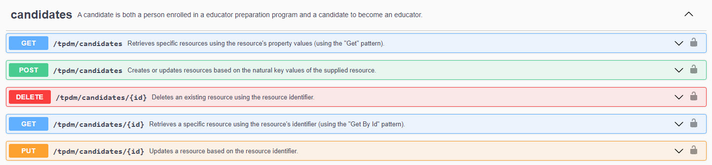

# Lab Exercise - Testing Extensions

This lab exercise, walks through the process of adding test cases for extensions to the API.

## Goal

The EPDM (formerly Teacher Preparation Data Model) extension enables comprehensive data
aggregation over the span of a educator's entire career, from application to and enrollment
into an EPP, through knowledge and skills demonstrated in fieldwork experiences,
to placement and performance as an in-service educator.
This extension includes candidate endpoints shown below.
The goal of this exercise is to create tests for this endpoint, incorporating them into both
the pipeclean and volume test playbooks.



For reference, here is a sample resource body that can be POSTed in SwaggerUI to create a new Candidate.

```javascript
{
    "id": "f251e34691f145eebddaa4af80a83a9a",
    "candidateIdentifier": "1000042",
    "birthDate": "2005-10-03",
    "economicDisadvantaged": false,
    "firstGenerationStudent": false,
    "firstName": "Bryce",
    "hispanicLatinoEthnicity": false,
    "lastSurname": "Beatty",
    "personalTitlePrefix": "M",
    "sexDescriptor": "uri://ed-fi.org/SexDescriptor#Not Selected",
    "addresses": [
      {
        "addressTypeDescriptor": "uri://ed-fi.org/AddressTypeDescriptor#Physical",
        "city": "Madison",
        "postalCode": "37598",
        "stateAbbreviationDescriptor": "uri://ed-fi.org/StateAbbreviationDescriptor#AA",
        "streetNumberName": "124 North Old Drive",
        "apartmentRoomSuiteNumber": "922",
        "buildingSiteNumber": "53",
        "doNotPublishIndicator": false,
        "periods": []
      }
    ],
    "disabilities": [],
    "electronicMails": [],
    "languages": [],
    "otherNames": [],
    "personalIdentificationDocuments": [],
    "races": [
      {
        "raceDescriptor": "uri://ed-fi.org/RaceDescriptor#Black - African American"
      }
    ],
    "telephones": []
  }
```

## Pre-Requisites

1. ODS and API version 5.3 or higher (includes TPDM extension out of the box) running on a
   server with sandbox deployment.
1. The performance test environment setup according to [User Guide](user-guide.md).
1. (optional) Familiarize yourself with [How to Create Resource
   Tests](how-to-create-tests.md). This exercise will walk you through steps
   that are described in more detail in that document.

## Create the Factory Class

The Factory class contains the data that will be posted to create a new
resource. These data are equivalent to the JSON payload shown in the example
above. We'll take advantage of the utility functions provided by this framework:

* `RandomSuffixAttribute` for a random `applicationIdentifier`
* `RandomDateAttribute` to set the `birthDate`
* `build_descriptor` to create the descriptor values.

Create file `candidate.py` in `~Suite-3-Performance-Testing\src\edfi-performance-test\edfi_performance_test\factories\resources`
with the following contents:

```python
import factory
from edfi_performance_test.factories.resources.api_factory import APIFactory
from edfi_performance_test.factories.descriptors.utils import build_descriptor
from edfi_performance_test.factories.utils import (
    RandomDateAttribute,
    RandomSuffixAttribute,
)


class CandidateFactory(APIFactory):
    candidateIdentifier = RandomSuffixAttribute("Candidate")
    addresses = factory.List(
        [
            factory.Dict(
                dict(
                    addressTypeDescriptor=build_descriptor("AddressType", "Physical"),
                    stateAbbreviationDescriptor=build_descriptor(
                        "StateAbbreviation", "NY"
                    ),
                    city="New York",
                    postalCode="10128",
                    streetNumberName="1234 Sesame St.",
                )
            )
        ]
    )
    birthDate = RandomDateAttribute()
    firstName = "Gordon"
    lastSurname = "Robinson"
    hispanicLatinoEthnicity = False
    sexDescriptor = build_descriptor("Sex", "Male")
```

## Create the Client Class

The parent class for API clients, `EdFiAPIClient`, defines this constant:

```python
API_PREFIX = '/data/v3/ed-fi'
```

However, the extensions are not at this path. Instead of `ed-fi` we need
`tpdm`. Thus in the code below, we need to initialize api_prefix value. This is
only appropriate for extensions and not for new additions to the core Ed-Fi API.

Create file `candidate.py` in `~Suite-3-Performance-Testing\src\edfi-performance-test\edfi_performance_test\api\client`
with the following contents:

```python
from locust.clients import HttpSession
from edfi_performance_test.api.client.ed_fi_api_client import EdFiAPIClient


class CandidateClient(EdFiAPIClient):
    endpoint = 'candidates'

    def __init__(self, client: HttpSession, token: str = "", api_prefix: str = ""):
        super(CandidateClient, self).__init__(client, token, '/data/v3/tpdm')
```

## Create the Pipeclean Test

In the pipeclean testing, we need to setup a value to change in the PUT request. Let's change the `hispanicLatinoEthnicity` from false to true.
Create file `candidate.py` in `~Suite-3-Performance-Testing\src\edfi-performance-test\edfi_performance_test\tasks\pipeclean`
with the following contents:

```python
from edfi_performance_test.tasks.pipeclean.ed_fi_pipeclean_test_base import EdFiPipecleanTestBase


class CandidatePipecleanTest(EdFiPipecleanTestBase):
    update_attribute_name = 'hispanicLatinoEthnicity'
    update_attribute_value = True
```

## Create the Volume Test

Create file `candidate.py` in `~Suite-3-Performance-Testing\src\edfi-performance-test\edfi_performance_test\tasks\volume` with the following contents:

```python
from locust import task

from edfi_performance_test.tasks.volume.ed_fi_volume_test_base import EdFiVolumeTestBase


class CandidateVolumeTest(EdFiVolumeTestBase):
    @task
    def run_sesame_street_scenarios(self):
        self.run_scenario('hispanicLatinoEthnicity', True)
```

## Execute Tests

The following commands will run both tests _only_, without executing any of the
other pipeclean or volume test scenarios. However, if you run the full test
suite, it will include the new `Candidate` tests (see [User Guide](user-guide.md) for details).
Open a PowerShell prompt. The second command assumes that you cloned the code repository into
`c:\src\Suite-3-Performance-Testing`; adjust as needed. The pipeclean test will naturally
finish running more quickly than the volume tests. In this example we [limit the
volume
tests](https://docs.locust.io/en/stable/running-without-web-ui.html#setting-a-time-limit-for-the-test)
to run only for 3 minutes.

```powershell
cd c:\src\Suite-3-Performance-Testing\src\edfi-performance-test
poetry run python edfi_performance_test --baseUrl "http://localhost:54746" --key  "emptyKey" --secret "emptysecret"  --testType "pipeclean" --testList  "CandidatePipecleanTest"
poetry run python edfi_performance_test --baseUrl "http://localhost:54746" --key  "emptyKey" --secret "emptysecret"  --testType "volume" --testList  "CandidateVolumeTest" --runTimeInMinutes "3"
```

The test runs [output test results](https://docs.locust.io/en/stable/retrieving-stats.html) to CSV files.
The output directory can be configured with `--output` parameter.

## Analyze Test Results

Your results will differ from those shown below based on factors include
hardware characteristics, what else is running on the server, and the size of
the database that you run against (if running on something other than the
sandbox). The response times are in milliseconds (ms).

### Pipeclean Requests

Some highlights:

* No failures occurred.
* Not surprisingly, creating a new resource took longer than other requests.
* Because Locust runs test clients in parallel, the total requests per second is
  not the average of the individual values. In this case we managed
  approximately 42 requests per second.

(!) These data are from a small-ish VM installed in single-server mode, which is far
from ideal. In other words, these numbers are not reflective of what a good
production setup can achieve.

| Type     | Name                                                                       | # reqs |    # fails  |    Avg |     Min |    Max  | Med  |   req/s | failures/s|
| -------- | ---------------------------------------------------------------------------|------- |------------ |------- | ------- | ------- |------|---------|-----------|
| GET      | /data/v3/tpdm/candidates                                                   |     1  |   0(0.00%)  |    676 |    676  |   676   |  676 |    0.00 |    0.00   |
| POST     | /data/v3/tpdm/candidates                                                   |     1  |   0(0.00%)  |     68 |     68  |    68   |   68 |    0.00 |    0.00   |
| DELETE   | /data/v3/tpdm/candidates/{id}                                              |     1  |   0(0.00%)  |     35 |     35  |    35   |   35 |    0.00 |    0.00   |
| GET      | /data/v3/tpdm/candidates/{id}                                              |     1  |   0(0.00%)  |     44 |     44  |    44   |   44 |    0.00 |    0.00   |
| PUT      | /data/v3/tpdm/candidates/{id}                                              |     1  |   0(0.00%)  |     52 |     52  |    52   |   52 |    0.00 |    0.00   |
| POST     | /oauth/token                                                               |     1  |   0(0.00%)  |    117 |    117  |   117   |  117 |    0.00 |    0.00   |
|Aggregated|                                                                            |     6  |   0(0.00%)  |    165 |     35  |   676   |   53 |    0.00 |    0.00   |


### Volume Requests

As expected from "volume tests", there are significantly more requests this
time. Thankfully there are still no failures. Interestingly, the median response
time of the volume tests is consistent with the time on the pipeclean test,
which suggests that the performance is fairly stable / consistent from one
request to the next.

|Type      |Name                         |Request Count|Failure Count|Median Response Time|Average Response Time|Min Response Time|Max Response Time|Average Content Size|Requests/s |Failures/s|
|----------|-----------------------------|-------------|-------------|--------------------|---------------------|-----------------|-----------------|--------------------|-----------|----------|
|POST      |/data/v3/tpdm/candidates     |1151         |0            |530                 |548.5437607          |40.5579          |1157.9496        |0                   |6.436864152|0         |
|DELETE    |/data/v3/tpdm/candidates/{id}|1143         |0            |470                 |478.8516234          |28.5396          |1010.0812        |0                   |6.39212487 |0         |
|PUT       |/data/v3/tpdm/candidates/{id}|559          |0            |520                 |543.0567556          |42.982           |1189.3005        |0                   |3.126157307|0         |
|POST      |/oauth/token                 |590          |0            |430                 |432.8916066          |24.6587          |1230.0343        |108                 |3.299522024|0         |
|          |Aggregated                   |3443         |0            |490                 |504.6982424          |24.6587          |1230.0343        |18.50711589         |19.25466835|0         |


### Volume Distribution

The 50% column represents the median and is the same value that you see in the
"Median response time" column above. This table gives us some sense of
consistency and can be used if you have an objective of achieving a certain
throughput for, let's say, 95% of requests.

|Type      |Name                         |50% |66%|75%        |80%        |90%      |95%        |98%        |99%        |99.90%|99.99%|100%|
|----------|-----------------------------|----|---|-----------|-----------|---------|-----------|-----------|-----------|------|------|----|
|POST      |/data/v3/tpdm/candidates     |530 |580|620        |640        |720      |800        |890        |980        |1100  |1200  |1200|
|DELETE    |/data/v3/tpdm/candidates/{id}|470 |500|540        |560        |620      |660        |730        |810        |1000  |1000  |1000|
|PUT       |/data/v3/tpdm/candidates/{id}|520 |570|610        |630        |700      |760        |890        |1000       |1200  |1200  |1200|
|POST      |/oauth/token                 |430 |460|480        |500        |540      |600        |690        |780        |1200  |1200  |1200|
|          |Aggregated                   |490 |540|570        |590        |670      |730        |820        |930        |1100  |1200  |1200|

## Further Experimentation

### Larger Initial Data Set

How well does this endpoint respond as the amount of data _already in the table_
increases? Artificially add 10,000 rows to the `Candidate` table with the
following script, and then re-run the volume tests using the same command from
earlier:

```sql
DECLARE @CandidateIdentifier as NVARCHAR(32)
DECLARE @Counter as INT = 0
DECLARE @Sex as INT = 0
DECLARE @FirstName as NVARCHAR(70)
DECLARE @LastName as NVARCHAR(70)

WHILE @Counter < 10000
BEGIN
    SELECT @CandidateIdentifier = CONCAT(N'padding-the-database-', @Counter)

    -- Evenly distribute the candidates by sex
    SELECT @Sex = CASE WHEN @Counter % 3 = 0 THEN 2200 WHEN @Counter % 3 = 1 THEN 2203 ELSE 2201 END
	SELECT @FirstName = CASE WHEN @Counter % 3 = 0 THEN 'John' WHEN @Counter % 3 = 1 THEN 'Angela' ELSE 'Benjamin' END
	SELECT @LastName = CASE WHEN @Counter % 3 = 0 THEN 'Davis' WHEN @Counter % 3 = 1 THEN 'Bliss' ELSE 'Hager' END

    exec sp_executesql N'INSERT INTO tpdm.Candidate ([CandidateIdentifier], [FirstName], [LastSurname], [SexDescriptorId], [BirthDate]) VALUES (@p0, @p1, @p2, @p3, @p4)',N'@p0 NVARCHAR(32),@p1 nvarchar(75),@p2 nvarchar(75),@p3 int,@p4 date',
    @p0=@CandidateIdentifier,@p1=@FirstName,@p2=@LastName,@p3=@Sex,@p4='2005-10-03'

    SET @Counter = @Counter + 1
END
```

#### Larger Data Set Results

|Type      |Name                         |Request Count|Failure Count|Median Response Time|Average Response Time|Min Response Time|Max Response Time|Average Content Size|Requests/s |Failures/s|
|----------|-----------------------------|-------------|-------------|--------------------|---------------------|-----------------|-----------------|--------------------|-----------|----------|
|POST      |/data/v3/tpdm/candidates     |1113         |0            |540                 |561.6957134          |49.3779          |1437.1876        |0                   |6.186559745|0         |
|DELETE    |/data/v3/tpdm/candidates/{id}|1108         |0            |490                 |492.9898255          |57.1677          |920.5948         |0                   |6.158767473|0         |
|PUT       |/data/v3/tpdm/candidates/{id}|582          |0            |540                 |561.0185259          |51.762           |1284.9441        |0                   |3.235020459|0         |
|POST      |/oauth/token                 |562          |0            |450                 |447.3611817          |29.2398          |863.4532         |108                 |3.123851371|0         |
|          |Aggregated                   |3365         |0            |500                 |519.860274           |29.2398          |1437.1876        |18.03744428         |18.70419905|0         |


#### Larger Data Set Distribution

|Type      |Name                         |50% |66%|75%        |80%        |90%      |95%        |98%        |99%        |99.90%|99.99%|100%|
|----------|-----------------------------|----|---|-----------|-----------|---------|-----------|-----------|-----------|------|------|----|
|POST      |/data/v3/tpdm/candidates     |540 |590|630        |650        |720      |800        |900        |990        |1300  |1400  |1400|
|DELETE    |/data/v3/tpdm/candidates/{id}|490 |520|540        |560        |600      |640        |700        |770        |890   |920   |920 |
|PUT       |/data/v3/tpdm/candidates/{id}|540 |570|600        |620        |690      |770        |950        |1100       |1300  |1300  |1300|
|POST      |/oauth/token                 |450 |470|490        |510        |550      |610        |660        |670        |860   |860   |860 |
|          |Aggregated                   |500 |550|580        |600        |660      |730        |820        |910        |1300  |1400  |1400|

#### Larger Data Set Analysis

* No failures occurred.
* Performance is fairly is consistent with the original volume.

### Additional Indexing

Presumably someone wants to query this Applicants table and have a very fast response. The primary key is the pairing (`EducationOrganizationId`, `ApplicantIdentifier`). Perhaps someone is interested in viewing applicant demographics using the following query:

```sql
SELECT
    [SexDescriptor].[CodeValue] as [Sex],
    [LimitedEnglishProficiencyDescriptor].[CodeValue] as [LimitedEnglishProficiency],
    [HispanicLatinoEthnicity],
    COUNT(1)
FROM
    [tpdm].[Candidate]
LEFT OUTER JOIN
    [edfi].[Descriptor] as [SexDescriptor] ON
       [tpdm].[Candidate].[SexDescriptorId] = [SexDescriptor].[DescriptorId]
LEFT OUTER JOIN
    [edfi].[Descriptor] as [LimitedEnglishProficiencyDescriptor] ON
        [tpdm].[Candidate].[LimitedEnglishProficiencyDescriptorId] = [LimitedEnglishProficiencyDescriptor].[DescriptorId]
GROUP BY
    [SexDescriptor].[CodeValue],
    [LimitedEnglishProficiencyDescriptor].[CodeValue],
    [HispanicLatinoEthnicity]
```

Although it is very contrived, create an index to optimize this query:

```sql
CREATE INDEX [IX_Candidate_Demographics] ON [tpdm].[Candidate] (
    [SexDescriptorId],
    [LimitedEnglishProficiencyDescriptorId]
) INCLUDE (
    [HispanicLatinoEthnicity]
)
```

Re-run the performance tests to see what the impact of this index is.

#### Indexing Results

|Type      |Name                         |Request Count|Failure Count|Median Response Time|Average Response Time|Min Response Time|Max Response Time|Average Content Size|Requests/s |Failures/s|
|----------|-----------------------------|-------------|-------------|--------------------|---------------------|-----------------|-----------------|--------------------|-----------|----------|
|POST      |/data/v3/tpdm/candidates     |1093         |0            |530                 |564.2058581          |35.8811          |1765.5874        |0                   |6.106090533|0         |
|DELETE    |/data/v3/tpdm/candidates/{id}|1087         |0            |470                 |493.2601397          |28.8334          |1594.6616        |0                   |6.07257128 |0         |
|PUT       |/data/v3/tpdm/candidates/{id}|560          |0            |520                 |567.8026396          |46.3658          |1698.9852        |0                   |3.128463585|0         |
|POST      |/oauth/token                 |595          |0            |430                 |452.5959524          |29.9803          |1239.1122        |108                 |3.323992559|0         |
|          |Aggregated                   |3335         |0            |490                 |521.7735666          |28.8334          |1765.5874        |19.26836582         |18.63111796|0         |


#### Indexing Distribution

|Type      |Name                         |50% |66%|75%        |80%        |90%      |95%        |98%        |99%        |99.90%|99.99%|100%|
|----------|-----------------------------|----|---|-----------|-----------|---------|-----------|-----------|-----------|------|------|----|
|POST      |/data/v3/tpdm/candidates     |530 |590|630        |660        |750      |870        |1100       |1400       |1700  |1800  |1800|
|DELETE    |/data/v3/tpdm/candidates/{id}|470 |510|540        |570        |640      |720        |860        |970        |1400  |1600  |1600|
|PUT       |/data/v3/tpdm/candidates/{id}|520 |580|620        |640        |770      |890        |1200       |1400       |1700  |1700  |1700|
|POST      |/oauth/token                 |430 |480|510        |530        |610      |670        |790        |870        |1200  |1200  |1200|
|          |Aggregated                   |490 |540|580        |610        |700      |800        |970        |1200       |1700  |1800  |1800|

#### Indexing Analysis

* There is a slight increase in response times, but performance fairly is consistent with that of before adding the index.

Conclusion: adding this index, at this volume of data, does not have a clear
negative impact, and is therefore the risk of introducing a performance problem
in production is very low.
