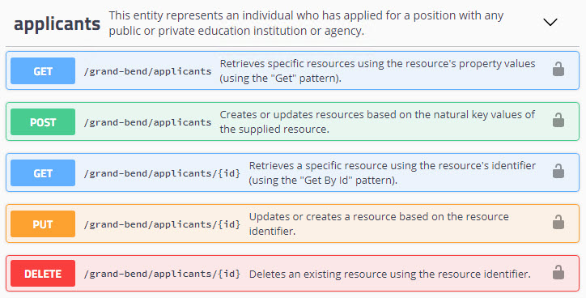

# Lab Exercise - Testing Extensions

This lab exercise, developed for the 2018 bootcamp, walks through the process of
adding test cases for extensions to the API.

## Goal

The Grand Bend sample extension supports job applicants and includes the
resource endpoints shown below. The goal of this exercise is to create tests for
this endpoint, incorporating them into both the pipeclean and volume test
playbooks.



For reference, here is a sample resource body that can be POSTed in SwaggerUI to create a new Applicant. It relies on the presence of the default Grand Bend education organizations (in `[edfi].[EducationOrganization]`).

```javascript
{
  "applicantIdentifier": "1234567890",
  "educationOrganizationReference": {
    "educationOrganizationId": 255901001
  },
  "addresses": [
    {
      "addressTypeDescriptor": "uri://ed-fi.org/AddressTypeDescriptor#Physical",
      "stateAbbreviationDescriptor": "uri://ed-fi.org/StateAbbreviationDescriptor#NY",
      "city": "New York",
      "postalCode": "10128",
      "streetNumberName": "1234 Sesame St."
    }
  ],
  "birthDate": "1950-10-04",
  "firstName": "Gordon",
  "lastSurname": "Robinson",
  "sexDescriptor": "uri://ed-fi.org/SexDescriptor#Male",
  "yearsOfPriorProfessionalExperience": 3,
  "yearsOfPriorTeachingExperience": 2
}
```

## Pre-Requisites

1. ODS and API version 3.0.0 with Grand Bend extensions running on a server with
   sandbox deployment.
1. [Preparation of a virtual environment](../README.md) for the performance
   testing.
1. Create a new sandbox called "perfTest". Update `test-config.json` with the
   new database name, client key (called `client_id` in the config file), and
   client secret. (!) no need to populate with sample data.
1. (optional) Familiarize yourself with [How to Create Resource
   Tests](how-to-create-tests.md). This exercise will walk you through steps
   that are described in more detail in that document.

## Create the Factory Class

The Factory class contains the data that will be posted to create a new
resource. These data are equivalent to the JSON payload shown in the example
above. We'll take advantage of the utility functions provided by this framework:

* `RandomSuffixAttribute` for a random `applicationIdentifier`
* `RandomDateAttribute` to set the `birthDate`
* `build_descriptor` to create the descriptor values.

Create file `applicants.py` in `edfi_performance\factories\resources` with the
following contents:

```python
import factory
from .. import APIFactory
from ..descriptors.utils import build_descriptor
from ..utils import RandomSuffixAttribute
from ..utils import RandomDateAttribute

class ApplicantsFactory(APIFactory):
    applicantIdentifier = RandomSuffixAttribute('Applicant')
    educationOrganizationReference = factory.Dict(
        dict(
            educationOrganizationId = 255901001
        )
    )
    addresses = factory.List([
        factory.Dict(
            dict(
                addressTypeDescriptor = build_descriptor('AddressType', 'Physical'),
                stateAbbreviationDescriptor = build_descriptor('StateAbbreviation','NY'),
                city = 'New York',
                postalCode = '10128',
                streetNumberName = '1234 Sesame St.'
            )
        )
    ])
    birthDate = RandomDateAttribute()
    firstName = 'Gordon'
    lastSurname = 'Robinson'
    sexDescriptor = build_descriptor('Sex','Male')
    yearsOfPriorProfessionalExperience = 3
    yearsOfPriorTeachingExperience = 2
```

## Create the Client Class

The parent class for API clients, `EdFiAPIClient`, defines this constant:

```python
API_PREFIX = '/data/v3/ed-fi'
```

However, the extensions are not at this path. Instead of `ed-fi` we need
`grand-bend`. Thus in the code below, we need to override this value. This is
only appropriate for extensions and not for new additions to the core Ed-Fi API.

Create file `applicants.py` in `edfi_performance\api\client` with the following
contents:

```python
from edfi_performance.api.client import EdFiAPIClient

class ApplicantsClient(EdFiAPIClient):
    endpoint = 'applicants'

    # Because this is in an extension, override the prefix in the base class
    API_PREFIX =  '/data/v3/grand-bend'
```

## Create the Pipeclean Test

In the pipeclean testing, we need to setup a value to change in the PUT request. Let's change the `yearsOfPriorTeachingExperience` from 2 to 3. Create file `applicants.py` in `edfi_performance\tasks\pipeclean` with the following contents:

```python
from edfi_performance.tasks.pipeclean import EdFiPipecleanTestBase

class ApplicantsPipecleanTest(EdFiPipecleanTestBase):
    update_attribute_name = 'yearsOfPriorTeachingExperience'
    update_attribute_value = 3
```

## Create the Volume Test

Create file `applicants.py` in `edfi_performance\tasks\volume` with the following contents:

```python
from locust import task

from edfi_performance.tasks.volume import EdFiVolumeTestBase

class ApplicantsVolumeTest(EdFiVolumeTestBase):
    @task
    def run_sesame_street_scenarios(self):
        self.run_scenario('yearsOfPriorTeachingExperience', 3)
```

## Execute Tests

The following commands will run both tests _only_, without executing any of the
other pipeclean or volume test scenarios. However, if you run the full test
suite, it will include the new `Applicants` tests. Open a PowerShell prompt. The
second command assumes that you cloned the code repository into
`c:\src\Suite-3-Performance-Testing`; adjust as needed. The pipeclean test will naturally
finish running more quickly than the volume tests. In this example we [limit the
volume
tests](https://docs.locust.io/en/stable/running-locust-without-web-ui.html#setting-a-time-limit-for-the-test)
to run only for 3 minutes.

```powershell
C:\virtualenv\EDFI_PERFORMANCE\Scripts\activate.bat
cd c:\src\Suite-3-Performance-Testing
locust -f .\pipeclean_tests.py -c 1 --no-web ApplicantsPipecleanTest --csv=ApplicantsPipeclean
locust -f .\volume_tests.py -c 20 --no-web ApplicantsVolumeTest --csv=ApplicantsVolume --run-time 3m
```

The `--csv` argument tells the Locust client to [output test
results](https://docs.locust.io/en/stable/retrieving-stats.html) to CSV files.
It creates two files, with suffixes `-distribution` and `-requests`.

## Analyze Test Results

Your results will differ from those shown below based on factors include
hardware characteristics, what else is running on the server, and the size of
the database that you run against (if running on something other than the
sandbox). The response times are in milliseconds (ms).

### Pipeclean Requests

Some highlights:

* No failures occurred.
* Not surprisingly, creating a new resource took longer than other requests.
* Because Locust runs test clients in parallel, the total requests per second is
  not the average of the individual values. In this case we managed
  approximately 42 requests per second.
  
(!) These data are from a small-ish VM installed in single-server mode, which is far
from ideal. In other words, these numbers are not reflective of what a good
production setup can achieve.

| Method | Name | # requests | # failures | Median response time | Average response time | Min response time | Max response time | Average Content Size | Requests/s |
| ------ | ---- | ---------- | ---------- | -------------------- | --------------------- | ----------------- | ----------------- | -------------------- | ---------- |
| GET | /data/v3/grand-bend/applicants | 1 | 0 | 190 | 189 | 189 | 189 | 657 | 1 |
| POST | /data/v3/grand-bend/applicants | 1 | 0 | 16 | 16 | 16 | 16 | 0 | 1 |
| DELETE | /data/v3/grand-bend/applicants/{id} | 1 | 0 | 16 | 16 | 16 | 16 | 0 | 1 |
| GET | /data/v3/grand-bend/applicants/{id} | 1 | 0 | 16 | 16 | 16 | 16 | 869 | 1 |
| PUT | /data/v3/grand-bend/applicants/{id} | 1 | 0 | 13 | 13 | 13 | 13 | 0 | 1 |
| POST | /oauth/token | 1 | 0 | 31 | 31 | 31 | 31 | 108 | 1 |
| None | Total | 6 | 0 | 16 | 47 | 13 | 189 | 272 | 6 |

### Pipeclean Distribution

The 50% column represents the median and is the same value that you see in the
"Median response time" column above. This table gives us some sense of
consistency and can be used if you have an objective of achieving a certain
throughput for, let's say, 95% of requests.

One interesting observation here: while half of all GET requests completed in 93
ms or less, there is quite a spread in the timing for the other half. A
reasonable (but unproven) hypothesis: the `Applicants` table was initially
empty. As we start adding records and growing the size of indexes, the database
query might take slightly longer. Furthermore, the API itself will take longer
to marshall the JSON for a larger payload.

| Name | # requests | 50% | 66% | 75% | 80% | 90% | 95% | 98% | 99% | 100% |
| ---- | ---------- | --- | --- | --- | --- | --- | --- | --- | --- | ---- |
| GET /data/v3/grand-bend/applicants | 1 | 190 | 190 | 190 | 190 | 190 | 190 | 190 | 190 | 190 |
| POST /data/v3/grand-bend/applicants | 1 | 16 | 16 | 16 | 16 | 16 | 16 | 16 | 16 | 16 |
| DELETE /data/v3/grand-bend/applicants/{id} | 1 | 16 | 16 | 16 | 16 | 16 | 16 | 16 | 16 | 16 |
| GET /data/v3/grand-bend/applicants/{id} | 1 | 16 | 16 | 16 | 16 | 16 | 16 | 16 | 16 | 16 |
| PUT /data/v3/grand-bend/applicants/{id} | 1 | 13 | 13 | 13 | 13 | 13 | 13 | 13 | 13 | 13 |
| POST /oauth/token | 1 | 31 | 31 | 31 | 31 | 31 | 31 | 31 | 31 | 31 |
| Total | 6 | 16 | 16 | 31 | 31 | 190 | 190 | 190 | 190 | 190 |

### Volume Requests

As expected from "volume tests", there are significantly more requests this
time. Thankfully there are still no failures. Interestingly, the median response
time of the volume tests is consistent with the time on the pipeclean test,
which suggests that the performance is fairly stable / consistent from one
request to the next.

| Method | Name | # requests | # failures | Median response time | Average response time | Min response time | Max response time | Average Content Size | Requests/s |
| ------ | ---- | ---------- | ---------- | -------------------- | --------------------- | ----------------- | ----------------- | -------------------- | ---------- |
| POST | /data/v3/grand-bend/applicants | 605 | 0 | 0 | 8 | 0 | 78 | 0 | 3.38
| DELETE | /data/v3/grand-bend/applicants/{id} | 605 | 0 | 16 | 17 | 0 | 108 | 0 | 3.38
| PUT | /data/v3/grand-bend/applicants/{id} | 605 | 0 | 15 | 11 | 0 | 108 | 0 | 3.38
| POST | /oauth/token | 20 | 0 | 16 | 17 | 14 | 31 | 108 | 0.11
| None | Total | 1835 | 0 | 15 | 12 | 0 | 108 | 1 | 10.25

### Volume Distribution

Here we see a high level of consistency - 80% of all requests take 16 ms or less. There are a small number of requests that take significantly longer.

| Name | # requests | 50% | 66% | 75% | 80% | 90% | 95% | 98% | 99% | 100% |
| ---- | ---------- | --- | --- | --- | --- | --- | --- | --- | --- | ---- |
| POST /data/v3/grand-bend/applicants | 605 | 0 | 15 | 16 | 16 | 16 | 16 | 32 | 46 | 78
| DELETE /data/v3/grand-bend/applicants/{id} | 605 | 16 | 16 | 16 | 16 | 29 | 31 | 32 | 46 | 110
| PUT /data/v3/grand-bend/applicants/{id} | 605 | 15 | 16 | 16 | 16 | 16 | 23 | 31 | 46 | 110
| POST /oauth/token | 20 | 16 | 16 | 16 | 16 | 30 | 31 | 31 | 31 | 31
| Total | 1835 | 15 | 16 | 16 | 16 | 16 | 30 | 32 | 46 | 110

## Further Experimentation

### Larger Initial Data Set

How well does this endpoint respond as the amount of data _already in the table_
increases? Artificially add 10,000 rows to the `Applicant` table with the
following script, and then re-run the volume tests using the same command from
earlier:

```sql
DECLARE @ApplicantIdentifier as NVARCHAR(100)
DECLARE @Counter as INT = 0
DECLARE @Sex as INT = 0

WHILE @Counter < 10000
BEGIN
    SELECT @ApplicantIdentifier = CONCAT(N'padding-the-database-', @Counter)

    -- Evenly distribute the applicants by sex
    SELECT @Sex = CASE WHEN @Counter % 3 = 0 THEN 8539 WHEN @Counter % 3 = 1 THEN 8540 ELSE 8541 END

    exec sp_executesql N'INSERT INTO gb.Applicant (LastModifiedDate, CreateDate, Id, BirthDate, CitizenshipStatusDescriptorId, FirstName, GenerationCodeSuffix, HighestCompletedLevelOfEducationDescriptorId, HighlyQualifiedAcademicSubjectDescriptorId, HighlyQualifiedTeacher, HispanicLatinoEthnicity, LastSurname, LoginId, MaidenName, MiddleName, PersonalTitlePrefix, SexDescriptorId, YearsOfPriorProfessionalExperience, YearsOfPriorTeachingExperience, ApplicantIdentifier, EducationOrganizationId) VALUES (@p0, @p1, @p2, @p3, @p4, @p5, @p6, @p7, @p8, @p9, @p10, @p11, @p12, @p13, @p14, @p15, @p16, @p17, @p18, @p19, @p20)',N'@p0 datetime,@p1 datetime,@p2 uniqueidentifier,@p3 datetime,@p4 int,@p5 nvarchar(4000),@p6 nvarchar(4000),@p7 int,@p8 int,@p9 bit,@p10 bit,@p11 nvarchar(4000),@p12 nvarchar(4000),@p13 nvarchar(4000),@p14 nvarchar(4000),@p15 nvarchar(4000),@p16 int,@p17 decimal(28,5),@p18 decimal(28,5),@p19 nvarchar(4000),@p20 int',
    @p0='2018-10-05 11:50:27.570',@p1='2018-10-05 11:50:27',@p2='A683BF41-F625-4640-AAC8-C6338A03045A',@p3='8233-03-24 00:00:00',@p4=NULL,@p5=ApplicantIdentifier,@p6=NULL,@p7=NULL,@p8=NULL,@p9=NULL,@p10=NULL,@p11=ApplicantIdentifier,@p12=NULL,@p13=NULL,@p14=NULL,@p15=NULL,@p16=@Sex,@p17=3.00000,@p18=2.00000,@p19=@ApplicantIdentifier,@p20=255901001

    SET @Counter = @Counter + 1
END
```

#### Larger Data Set Results

| Method | Name | # requests | # failures | Median response time | Average response time | Min response time | Max response time | Average Content Size | Requests/s |
| ------ | ---- | ---------- | ---------- | -------------------- | --------------------- | ----------------- | ----------------- | -------------------- | ---------- |
| POST | /data/v3/grand-bend/applicants | 625 | 0 | 0 | 27 | 0 | 976 | 0 | 3.51 |
| DELETE | /data/v3/grand-bend/applicants/{id} | 625 | 0 | 30 | 31 | 14 | 197 | 0 | 3.51 |
| PUT | /data/v3/grand-bend/applicants/{id} | 625 | 0 | 15 | 15 | 0 | 321 | 0 | 3.51 |
| POST | /oauth/token | 20 | 0 | 5300 | 6308 | 16 | 15453 | 108 | 0.11 |
| None | Total | 1895 | 0 | 16 | 90 | 0 | 15453 | 1 | 10.63 |

#### Larger Data Set Distribution

| Name | # requests | 50% | 66% | 75% | 80% | 90% | 95% | 98% | 99% | 100% |
| ---- | ---------- | --- | --- | --- | --- | --- | --- | --- | --- | ---- |
| POST /data/v3/grand-bend/applicants | 625 | 0 | 15 | 16 | 16 | 16 | 16 | 670 | 910 | 980 |
| DELETE /data/v3/grand-bend/applicants/{id} | 625 | 30 | 31 | 31 | 32 | 32 | 34 | 130 | 160 | 200 |
| PUT /data/v3/grand-bend/applicants/{id} | 625 | 15 | 16 | 16 | 16 | 16 | 31 | 46 | 270 | 320 |
| POST /oauth/token | 20 | 6400 | 9400 | 11000 | 12000 | 14000 | 15000 | 15000 | 15000 | 15000 |
| Total | 1895 | 16 | 16 | 30 | 30 | 31 | 32 | 270 | 930 | 15000 |

#### Larger Data Set Analysis

* No failures occurred.
* POST and PUT performance is fairly is consistent with the original volume
  testing for 90% of the calls, but the remainder are starting to take longer.
* DELETE times are nearly double what they were before.
* The outliers were much higher, especially for the POST request.
* Token response time is terrible! That is very odd and would not seem to have
  anything to do with the `Applicants` resource.

### Additional Indexing

Presumably someone wants to query this Applicants table and have a very fast response. The primary key is the pairing (`EducationOrganizationId`, `ApplicantIdentifier`). Perhaps someone is interested in viewing applicant demographics using the following query:

```sql
SELECT
    [SexDescriptor].[CodeValue] as [Sex],
    [CitizenshipDescriptor].[CodeValue] as [Citizenship],
    [HispanicLatinoEthnicity],
    COUNT(1)
FROM
    [gb].[Applicant]
LEFT OUTER JOIN
    [edfi].[Descriptor] as [SexDescriptor] ON
        [Applicant].[SexDescriptorId] = [SexDescriptor].[DescriptorId]
LEFT OUTER JOIN
    [edfi].[Descriptor] as [CitizenshipDescriptor] ON
        [Applicant].[CitizenshipStatusDescriptorId] = [CitizenshipDescriptor].[DescriptorId]
GROUP BY
    [SexDescriptor].[CodeValue],
    [CitizenshipDescriptor].[CodeValue],
    [HispanicLatinoEthnicity]
```

Although it is very contrived, create an index to optimize this query:

```sql
CREATE INDEX [IX_Applicant_Demographics] ON [gb].[Applicant] (
    [SexDescriptorId],
    [CitizenshipStatusDescriptorId]
) INCLUDE (
    [HispanicLatinoEthnicity]
)
```

Re-run the performance tests to see what the impact of this index is.

#### Indexing Results

| Method | Name | # requests | # failures | Median response time | Average response time | Min response time | Max response time | Average Content Size | Requests/s |
| ------ | ---- | ---------- | ---------- | -------------------- | --------------------- | ----------------- | ----------------- | -------------------- | ---------- |
| POST | /data/v3/grand-bend/applicants | 609 | 0 | 0 | 28 | 0 | 1049 | 0 | 3.41 |
| DELETE | /data/v3/grand-bend/applicants/{id} | 609 | 0 | 30 | 30 | 9 | 203 | 0 | 3.41 |
| PUT | /data/v3/grand-bend/applicants/{id} | 609 | 0 | 15 | 17 | 0 | 421 | 0 | 3.41 |
| POST | /oauth/token | 20 | 0 | 5700 | 6627 | 14 | 15751 | 108 | 0.11 |
| None | Total | 1847 | 0 | 16 | 96 | 0 | 15751 | 1 | 10.34 |

#### Indexing Distribution

| Name | # requests | 50% | 66% | 75% | 80% | 90% | 95% | 98% | 99% | 100% |
| ---- | ---------- | --- | --- | --- | --- | --- | --- | --- | --- | ---- |
| POST /data/v3/grand-bend/applicants | 609 | 0 | 15 | 16 | 16 | 16 | 16 | 640 | 670 | 1000 |
| DELETE /data/v3/grand-bend/applicants/{id} | 609 | 30 | 31 | 31 | 31 | 32 | 32 | 110 | 160 | 200 |
| PUT /data/v3/grand-bend/applicants/{id} | 609 | 15 | 16 | 16 | 16 | 16 | 31 | 47 | 390 | 420 |
| POST /oauth/token | 20 | 6700 | 9800 | 12000 | 13000 | 15000 | 16000 | 16000 | 16000 | 16000 |
| Total | 1847 | 16 | 16 | 30 | 30 | 31 | 32 | 390 | 1000 | 16000 |

#### Indexing Analysis

* Average response times, and the 95% threshold, are basically unchanged.
* Those token calls are taking longer and longer.

Conclusion: adding this index, at this volume of data, does not have a clear
negative impact, and is therefore the risk of introducing a performance problem
in production is very low.