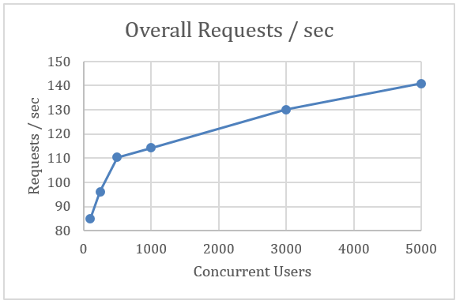
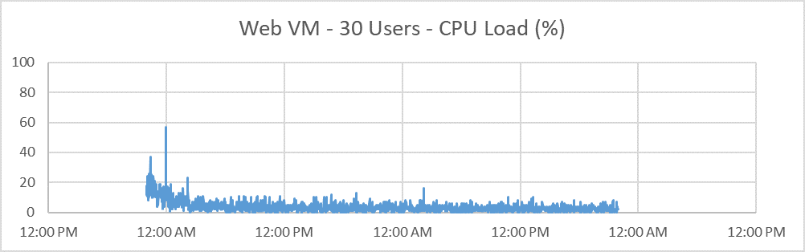

# Summary 3.0.0 Test Results

_by Patrick Lioi, Headspring_

Pipeclean, volume, stress, and soak testing on the Ed-Fi ODS/API 3.0.0 was
performed in a basic test lab setup. The results and findings are presented
below as a benchmark for testing future releases. While these results provide
some meaningful data to help size an installation, they cannot be used to
extrapolate performance in more production-like environments. Agencies are
encouraged to run the performance testing framework in their own environment to
determine the most appropriate hardware configuration for their needs.

## Summary of Findings

1. The testing infrastructure is working as intended, easily generating
   representative load across many endpoints from many concurrent clients,
   collecting server metrics throughout the run.
1. The ODS performed well under the Volume test cases, encountering no errors
   under this initial load.
1. The Pipeclean tests run quickly enough that they can be used as intended.
   They provide a quick verification that the ODS is stable prior to more
   extensive Volume/Stress/Soak testing, and they identify bottlenecks.
1. The Pipeclean tests reveal 4 endpoints at high risk for SQL timeouts, even
   when there is relatively low CPU/Memory pressure, suggesting that the
   underlying `SELECT` queries could be tuned. Most endpoints return results
   quickly.
1. The ODS experienced few failures under the stress tests, however:
    1. At all stress test loads, a small fraction of requests failed. There was
       no correlation between failure rate and number of concurrent users, so
       this risk exists for any ODS installation. One query was a frequent
       deadlock victim.
    1. As the load on the ODS increased, response times degraded significantly
       without SQL timeouts. Instead, the web requests themselves were stacking
       up, waiting for their turn to be handled.
    1. Since the bottleneck came in the form of web requests queueing up, system
       resources were never taxed.
    1. There was no clear "breaking point" for the ODS, though there was a sharp
       change in requests handled / second at a load of 1000 concurrent users,
       likely at the point where requests would become queued by the web server.
1. When sizing a SQL Server machine in a deployment environment, we recommend
   the CPU/memory specs be selected based on the size of the data set rather
   than the expected amount of activity.
1. The testing tool can generate requests at the rate of 12M / 24 hours, far
   exceeding goal load of 8.24M requests, even from one load generation VM. This
   load is generated with 5000 concurrent users. The load generation VM is
   right-sized and fully leveraged.
1. Overall, based on the stress testing,  SQL query tuning might focus on two
   areas:
    1. Queries which cause a particular set of `SELECT`s to deadlock.
    1. A small number of POST requests which have the slowest average response
       times.
1. We recommend Soak tests run for 48h. This is long enough to reveal important
   trends, allows the system to reach a steady state for many hours, and
   provides an accurate measurement of requests/day throughput. We do not expect
   longer Soak tests to reveal more information.
1. During Soak testing, The ODS shows no evidence of memory leaks.
1. Failures experienced during long duration test runs match those previously
   reported for short durations. The pattern of rare deadlocks simply repeats
   over time.
1. The performance issue discovered during previous Stress testing, in which IIS
   begins to place many simultaneous requests into the ASP.NET Request Queue
   resulting in long response times, remains as expected. Unlike Stress testing,
   **Soak testing reveals the impact degrades throughput over the first few
   hours, dramatically limiting the number of requests handled per day while
   leaving the hardware underutilized**. Avoid making throughput estimates based
   on tests that last less than 24h.
1. General guidance based on Soak testing is the same as for Stress testing: to
   tune the worst-offending queries as previously reported, and to recommend
   multiple load-balanced web servers of multiple cores as suggested by Stephen
   Fuqua to minimize waste in the ASP.NET Request Queue.


## Test Environment

### Data Set

The [Northridge v3 data
set](https://console.aws.amazon.com/s3/buckets/edfi_ods_samples/?region=us-east-2&tab=overview),
which contains 21,628 students.

### Azure Test Lab Virtual Machines

The test lab uses a three-server setup: one each for the database, web
applications, and the Locust performance testing. VM "Sizes" listed here, such
as "DS11_v2", are Microsoft-defined names for the specs of an Azure VM. Key
specs are listed beside these size names. These sizes were chosen as their specs
are comparable to those of the Vendor Certification VMs but have SSD disks to
more closely match a production environment.

Database VM

* Image: Free SQL Server License: SQL Server 2017 Developer on Windows Server
  2016
* Size: DS11_v2 (Standard, 2 vcpus, 14 GB ram, 6400 max iops, 28GB local SSD)

Web VM

* Image: [smalldisk] Windows Server 2016 Datacenter
* Size: B2ms (Standard, 2 vcpus, 8 GB ram, 4800 max iops, 16GB local SSD)

Test Runner VM

* Image: [smalldisk] Windows Server 2016 Datacenter
* Size: B2ms (Standard, 2 vcpus, 8 GB ram, 4800 max iops, 16GB local SSD)

## Pipeclean Test Results

Pipeclean testing hits each endpoint one at a time in series. It is meant to
check for overall stability of the API rather than to provide real-world load,
though it can be useful to identify endpoints that are either failing or
particularly slow to respond.

The test run took 4m50s to hit each endpoint, confirming that running the
pipeclean test suite as a useful way to get quick feedback on the ODS API's
overall stability. During this run, 3 endpoints failed due to SQL timeouts and 1
was at risk for timing out. The SQL timeouts present to the client as HTTP
response "500 Internal Server Error". Not surprisingly, all involve GET requests
against the ODS's larger tables:

* `GET /EdFi.Ods.WebApi/data/v3/ed-fi/studentGradebookEntries`
* `GET /EdFi.Ods.WebApi/data/v3/ed-fi/studentSectionAttendanceEvents`
* `GET /EdFi.Ods.WebApi/data/v3/ed-fi/grades`
* `GET /EdFi.Ods.WebApi/data/v3/ed-fi/studentSectionAssociations`

For a pipeclean test run, the primary thing to focus on other than failure
responses is the "Max response time" collected by the test runner. Most
endpoints respond quickly, a few took longer than 1 second, and one endpoint
(studentSectionAssociations) took 18s, putting it at risk for timeouts like the
others listed in above:

| Max Response Time | Number of Endpoints |
| ----------------- | ------------------- |
| 0ms - 499ms | 1205 |
| 500ms - 999ms | 48 |
| 1000ms - 9999ms | 6 |
| 18000ms | 1 |

Due to the small sample size and brief duration of a pipeclean test run, CPU and
memory metrics are not particularly informative. However, there are two points
worth noting.

First, they do show that there was low CPU and memory pressure on the Web VM,
suggesting the web app itself is not being wasteful during the slower API calls:


Second, they show that there were occasional moderate CPU spikes, but low memory
pressure on the Database VM:


Since the system was not particularly taxed during this run, we wouldn't
anticipate a larger Azure VM Size selection to have prevented the timeouts.
Mitigation: Review the SQL Server execution plan and index definitions for the
`SELECT` statements hit when fetching `studentGradebookEntries`,
`studentSectionAttendanceEvents`, `grades`, and `studentSectionAssociations`.


Since the system was not particularly taxed during this run, we wouldn't
anticipate a larger Azure VM Size selection to have prevented the timeouts.

_Potential Mitigation_: Review the SQL Server execution plan and index
definitions for the SELECT statements hit when fetching
`studentGradebookEntries`, `studentSectionAttendanceEvents`, `grades`, and
`studentSectionAssociations`.

## Volume Test Results

Volume testing repeatedly exercises the subset of endpoints as described by the
"Ed-Fi Student Information Systems API V3 Certification" documentation, using
many concurrent clients, for a fixed duration. It is meant to simulate
real-world workloads.

This initial volume test ran for 30m with 30 simultaneous clients. It
successfully handled all requests.

The Web VM experienced minimal CPU/Memory pressure, suggesting that the VM is
sized appropriately and could handle even more concurrent clients during Stress
testing, should the database VM keep up:


The Database VM similarly experienced minimal CPU pressure, with occasional
spikes around 50-60%:


The memory pressure was consistently at 90% during the whole run, which may at
first seem alarming:


However, SQL Server quite deliberately consumes as much memory as you allow it,
to maximize the performance benefits of cached data. In a SQL-dedicated VM such
as this one, you wouldn't want SQL Server to leave memory unused. Because the
CPU pressure was so minimal, the VM is likely sized appropriately and could
handle even more concurrent clients during Stress testing.

If Stress testing reveals a tipping point at the current VM size, naturally the
VM size could be increased to see how well that improves the ODS API's behavior
under stress. For instance, there may be a missed opportunity here to cache even
more data. If stress testing at this VM size reveals a point where the system
begins to fail, and if increasing the VM size restores stability, then the test
results would provide a more useful suggestion to Ed-Fi Community members.

## Stress Testing

### Approach for Stress Testing

Because the previous Volume test run revealed no failed requests under a light
load, we originally set out to simply run the Volume test suite multiple times
while increasing the number of concurrent users until the ODS began to fail.
Then, we would decrease the number of concurrent users until the system could
perform again with no failed requests, thus narrowing in on the ODS's breaking
point.

However, we encountered a small number of failed requests due to deadlocks even
at relatively light loads. Adjusting the approach, we increased the load
repeatedly with a new intent, to see whether those failure rates would increase
as the load increased. Failure rates did not increase as the load increased,
though response times did increase sharply.

Given that the incidence of failures was low and appeared to be unaffected by
the number of concurrent users, we needed to confirm whether the load being
generated was truly maximized and representative of production scenarios before
we could declare the stress testing complete. From the Ed-Fi Special Interest
Group on [Data Quality and API
Reliability](https://techdocs.ed-fi.org/pages/viewpage.action?spaceKey=ESIG&title=Data+Quality+and+API+Reliability),
we know that Wisconsin reported 8.24M requests in a 24 hour period. Stress
testing then focused on meeting and exceeding that baseline rate.
Experimentation showed that a single load-generating client VM can exceed a 12M
request / day rate, and that this is a practical upper bound for a single client
VM.

Even with a single VM generating all the load, the ODS experienced a tipping
point where performance degrades in the form of increasingly delayed response
times rather than increasing failures rates. ODS web requests queue up and wait
rather than fail under increasing loads. The decision between Ed-Fi and
Headspring was to complete this stress test with the single client VM rather
than to increase Test Lab maintenance costs with extra VMs.

Having explored the space of load generation, having confirmed that failure
rates did not increase under increasing load, and having witnessed a meaningful
performance tipping point, we then focused our analysis on the nature of the few
failures detected and the response time degradation, looking for patterns.

The remainder of this document details the above findings for both the
client-side load generation and the server side ODS behavior, across these many
stress tests.

### Stress Testing Execution

_Editor's note: the original instructions have been replaced based on further
refactoring performed after the stress testing was completed_

In the deployment environment, run the command

```powershell
.\run-tests.bat stress
```

This command launches 1000 clients with hatch rate 25 and for a run time of 30
minutes. The stress test results below show testing at 1000, 3000, and 5000
clients. To adjust the client number, temporarily change the `-ClientCount`
argument in function `Invoke-StressTests`, found in file `TestRunner.ps1`.

### Load Generation Results

In addition to revealing information about the ODS's behavior under load, the
stress tests provided concrete information about the load generation itself. We
have found the practical upper limit for load generation from a single client
machine.

For each 30m stress test run, the system reports a total number of requests
issued. Given these totals, we estimate the number of requests which would be
generated during a 24 hours period, to compare the load generation against that
of Wisconsin's reported 8.24M requests: `[Total Requests During 30m Test] * 2 *
24`.


Here, we see that there are natural limits to the load generation from a single
machine, and that in the Test Lab environment that limit is approximately 12M
requests per 24-hour period. Generating more concurrent users involves more
resources spent on managing those users and collecting their results, so it is
not surprising that we see an apparent limit here.

A natural question then, is whether this is the true limit of load generation
for a single machine, or whether the load could be easily increased merely by
changing this client VM's "Size" in Azure.  To answer this question, it's
important to know about a limited operating system resource: outgoing port
numbers. If a client machine makes many outgoing requests in a short amount of
time, it can eventually exhaust the operating system's limited number of
outgoing ports. If a client ever caused that "port exhaustion", subsequent
requests would fail on the client side having never reached the server side. The
operating system does free up this finite resource as requests complete, but
only after a deliberate noticeable delay during which the ports remain in a
TIME_WAIT state. During the many stress test runs, we issued the following
command periodically to monitor the risk of port exhaustion:

```powershell
netstat -ano | find /C "TIME_WAIT"
```

Even in the worst case, the number of unavailable ports held steady in a safe
range, but generating a higher load via increasing CPU/RAM would be highly
likely to cause port exhaustion. A test run that experiences port exhaustion on
the client side would be an invalid test; the failures would appear to the ODS
as a sudden lack of traffic.

The risk of port exhaustion combined with the 12M requests/day "wall" at the
current VM size suggests that this rate is our realistic limit for a single
client VM of any size. The VM is right-sized and fully leveraged.

### Stress Test Results

#### Failure Rate vs Load

There was no correlation between number of failed requests and number of
concurrent users. In the worst case (1000 concurrent users), the system
experienced failed requests a mere 0.01% of the time:


#### Deadlocked Queries

Although the vast majority of requests succeed across all of these loads, a few
patterns appeared for the requests that did fail, all around deadlocks.

When SQL Server discovers a deadlock, it chooses a "deadlock victim" to resolve
the issue. The deadlock victim query is the one logged by the ODS. SQL Server
tries to choose the least-costly transaction as the victim, to allow a
more-costly transaction to complete. In other words, the deadlock victim queries
are not the culprits themselves, but indicate which tables and records were
under high contention at the time of deadlock.

* Most failures surface in the ODS logs with the error message "Failed to
  execute multi query: …SQL STATEMENT… was deadlocked on lock resources with
  another process and has been chosen as the deadlock victim."
* Most of those deadlock failures occur for the same NHibernate query batch, one
  which is executed when interacting with `/data/v3/ed-fi/schools/{id}`
  endpoints (POST, PUT, DELETE).
* Although far less frequent, the next repeated deadlocked query batch is
  encountered when issuing a PUT against
  `/data/v3/ed-fi/studentSpecialEducationProgramAssociations/{id}`
* See "Attachment A - Most Frequently-Deadlocked Query Batches.txt" for the
  NHibernate-generated SQL for the above 2 deadlocking hot spots.

#### Stress Test Web Server Resources

Even under these heavy loads, the ODS web server experienced no serious strain
on CPU / Memory. To keep the analysis of CPU / Memory usage focused, we include
here the metrics collected during the 1000-, 3000-, and 5000-user test runs.

The web server's memory usage was minimal and virtually identical across these
loads, holding at 25-30%:

  

The web server's CPU usage fell mainly in the 30%-60% range regardless of the
load. Under the highest load, there were occasional spikes in the 60-70% range:

  

#### Stress Test SQL Server Resources

Even under these heavy loads, the ODS's SQL Server experienced no serious strain
on CPU / Memory, while fully taking advantage of SQL Server's caching. To keep
the analysis of CPU / Memory usage focused, we include here the metrics
collected during the 1000-, 3000-, and 5000-user test runs.

The SQL VM's memory usage was virtually identical across these loads, holding at
60%:


Recall that during the original low-concurrency run of the Volume test suite,
the SQL VM had a similar plot around 90%. SQL Server caching aggressively uses
available memory to serve results quickly. Between that previous Volume run and
these Stress tests, we increased the SQL VM Size in Azure to more realistically
match a production system and to determine whether that 90% represented a missed
opportunity to cache more. Here, we see that the system can effectively cache
everything it needs for the Northridge data set with healthy room to spare for a
larger data set. Here, we also see that there is no effect on SQL Server's
memory usage as the web request/day rate grows by millions.

The SQL VM's CPU usage was similarly stable as the web request/day rate grows by
millions:


The CPU usage holds in a steady low-risk range with occasional drops well below
10%. Conclusion: When sizing a SQL Server machine in a deployment environment,
we recommend the CPU/memory specs be selected based on the size of the data set
rather than the expected amount of activity.

#### Degrading Response Times

Clearly, the ODS Web Server and SQL Server dealt with a heavy load without
running low on system resources. Reviewing web request response times, however,
shows meaningful evidence of the system degrading under increasing loads in the
form of **increasing response times across all endpoints but without any SQL
timeouts**:

 

#### Overall Requests Handled / Second

To make sense of that response time trend, we take a closer look at requests
handled per second. We see two important things. First, the ODS is handling
requests at a rate consistent with the rate of requests being initiated. Over
the course of a day at this rate, we'd expect all 12M requests initiated by the
performance tests to be handled. Second, **we see our first noteworthy inflection
point in the data**: as we approach 500 concurrent users, the requests/sec appears
to scale linearly with the user count. From 500 to 1000 users, though, the slope
changes dramatically, which likely corresponds with the point where all of the
available worker threads become busy, and the web server has to begin queueing
up requests. Although the requests are eventually handled successfully, they sit
in a queue whose size corresponds with the number of simultaneous requests
issued by the client, delaying response times across all endpoints.



Recommendations:

* Update the performance testing metrics collection to include the
  "ASP.NET\Requests Queued" performance counter during all future test runs, as
  further confirmation of the observed behavior. This counter will be added in
  O3PERF-172 prior to Soak testing.
* Since requests queue up under heavy load while not taxing either the web
  server or SQL server, the most likely area for improvement is to focus on
  tuning queries which lead to the detected deadlocks, and queries issued by the
  slowest overall endpoints.

#### Slowest Endpoints

The endpoints with the slowest average response time were consistent across runs
of different concurrent user counts. From the 5000-user test, the slowest
responses are all POSTs against the follow resources:

* `POST /data/v3/ed-fi/staffs`
* `POST /data/v3/ed-fi/cohorts`
* `POST /data/v3/ed-fi/courses`
* `POST /data/v3/ed-fi/calendars`
* `POST /data/v3/ed-fi/assessments`
* `POST /data/v3/ed-fi/schools`
* `POST /data/v3/ed-fi/learningStandards`
* `POST /data/v3/ed-fi/learningObjectives`

## Soak Testing

### Approach for Soak Testing

We ran the Volume test suite for 48h at a light 30-user load. As with
short-duration Volume testing, the tests for this light load showed a stable
system and revealed no new information.

We then ran the Volume test suite for 48h at a moderate load of 500 users,
enough to reveal important trends affecting overall throughput. There are
diminishing returns on running the Soak tests longer than 48h as by that point
the system reaches a steady state for many hours.

After initial analysis of the 48h runs, we found evidence that performance
degrades during the first few hours and then reaches a steady state. We
performed additional 500-user tests at durations of 30m and 2h to take a closer
look at that pivotal timeframe.

The remainder of this document details the above findings across these Soak
tests.

### Soak Test Execution

In the Azure environment, these tests were performed by remoting into the
ods-3-perf-test VM and running the "Run Stress Tests" desktop shortcut to invoke
the performance testing tools with Soak testing parameters. This shortcut
performs the following command from the context of the test runner's deployment
folder:

```powershell
.\run-tests.bat soak
```

This command ultimately invokes the Locust tool, using the Volume suite of test
cases, starting one new client per second until reaching the load of 500
concurrent clients, then running for 48h. When these characteristics were
temporarily adjusted, such as the client count or duration, those constants were
modified within TestRunner.ps1 in the Invoke-SoakTests function. The constants
in source control represent a typical recommended soak test.

### Soak Test Results

#### Errors

Failed requests during Soak testing mirror the results previously reported for
Stress testing. Running the tests for a longer duration did not have an impact
on the character or frequency of failures. As with Stress testing at short
durations, less than 0.01% of requests fail, due to SQL deadlocks. The queries
chosen by SQL Server as the "deadlock victim" are also consistent with those
previously reported for Stress testing.

#### Soak Test SQL Server Resources

The SQL Server's CPU load remained consistent across the Soak test, remaining
low with occasional spikes around 40%. This is consistent with the previous
Stress test:

 

The SQL Server's memory usage remained consistent across the Soak test,
remaining at approximately 60% for the entire duration. This is consistent with
the previous Stress test:

 

As we saw with earlier Volume and Stress testing, SQL Server makes effective use
of available memory to maximize caching, so these results are to be expected.
More importantly, they show no evidence of memory leaks or additional stress
over time.

#### Web Server Resources

Overall, the Web Server's CPU usage remained consistent across the Soak test,
spending most of its time below 20%, with only occasional brief spikes. Later,
in the Limited Throughput section, we take a closer look at the CPU trend in the
first few hours:




The Web Server's memory usage remained consistent across the Soak test,
remaining at approximately 30% for the entire duration:

 

These results are consistent with the memory and CPU usage encountered during
Stress testing, and more importantly shows no evidence of memory leaks in the
ODS.

#### Web Server Request Queue

Previously, Stress testing revealed that under high numbers of concurrent users,
response times would degrade as many requests waited in the ASP.NET request
queue. Under high load, IIS does its job well by keeping the system stable at
the cost of queueing up incoming requests.

In reaction to that evidence, we added the "ASP.NET\Requests Queued" performance
counter to the performance tools, to monitor that queue size moving forward. As
expected the queue did experience some strain, especially early on. Periodic
measurement of the performance counter maxed out at 255 queued requests.

#### Limited Throughput

Note that despite the general noise in the 500-user CPU charts above, there is a
noticeable downward trend in the first few hours. To investigate that trend in
more detail, we performed 2 shorter tests at the same load of 500 users, one for
30m and one for 2h. These tests of moderate load at different durations reveals
a significant impact on throughput:


The requests/second throughput rate drops dramatically during the first hours of
activity, and this has lasting effects throughout the rest of the run. A 48h run
appears to reveal the true throughput of this system configuration under a
moderate load: 2.2 million requests per day.

This trend line is matched by CPU usage on both the Web Server and SQL Server.
After the first several hours, the servers arrive at approximately 5%
utilization, likely waiting to handle queued requests.

The most likely remedy aside from query tuning is to recommend load-balanced web
servers with multiple cores, allowing more simultaneous work under heavy load.